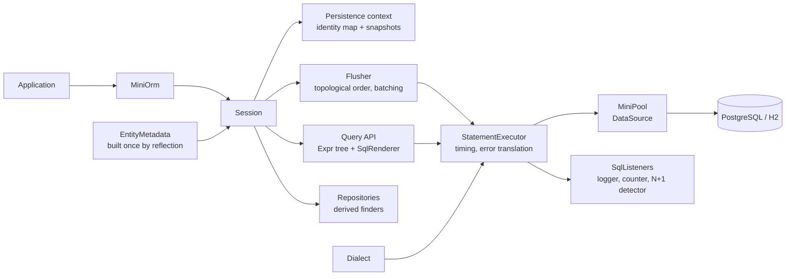

# mini-orm

A small ORM and a JDBC connection pool for Java 25, with no runtime dependencies beyond the JDK. Annotated classes map to tables, SQL is generated per dialect (PostgreSQL, H2), a session tracks dirty entities by snapshot comparison and flushes them in foreign-key order with JDBC batching, `@Version` gives optimistic locking, and queries are written with method references and bound parameters only. The pool (`mini-orm-pool`) is a `DataSource` that works on its own.

[](https://github.com/mgeladzerezo/mini-orm/actions/workflows/ci.yml)

## Example

```java
@Entity
public class User {
    @Id @GeneratedValue private Long id;
    @Column(unique = true, nullable = false) private String email;
    private int points;
    @Version private long version;
    protected User() {}
    public User(String email) { this.email = email; }
    public String getEmail() { return email; }
    public int getPoints() { return points; }
    public void setPoints(int points) { this.points = points; }
}

MiniPool pool = MiniPool.create("jdbc:postgresql://localhost/app", "app", "secret");
MiniOrm orm = MiniOrm.builder().dataSource(pool).entities(User.class).logSql(System.out::println, Duration.ofMillis(200)).build();
orm.schema().create();

orm.runInTransaction(session -> session.persist(new User("ada@example.com")));

orm.runInTransaction(session -> {
    User ada = session.from(User.class).where(User::getEmail, eq("ada@example.com")).one().orElseThrow();
    ada.setPoints(ada.getPoints() + 10);   // no save(): only the changed column and the version are updated
});
List<User> top = orm.inSession(s -> s.from(User.class).where(User::getPoints, ge(10)).orderBy(Sort.desc(User::getPoints)).limit(5).list());
```

## Architecture



## Quick start

```
docker compose up --build
```

then open http://localhost:8204 : the page lists posts, shows live pool metrics and the SQL the ORM ran (also printed on the container's stdout). Create a post in the form and watch the statements. `GET /api/posts`, `/api/metrics` and `/api/sql` return JSON. Without Docker: `./mvnw -pl mini-orm-examples -am package` then `java -jar mini-orm-examples/target/mini-orm-examples-0.1.0.jar` (in-memory H2 unless `JDBC_URL` is set).

Documentation: [getting started](docs/getting-started.md), [mapping reference](docs/mapping.md), [sessions and dirty checking](docs/sessions.md), [querying](docs/querying.md), [the pool](docs/pool.md), [how it works inside](docs/internals.md), [comparison with Hibernate/JPA](docs/comparison.md).

## How it works

* **Dirty checking without enhancement.** A snapshot of database-side column values is stored when an entity becomes managed; flush compares it with the live object and writes only the changed columns. See [`Flusher`](mini-orm-core/src/main/java/io/github/mgeladzerezo/miniorm/internal/Flusher.java) and [sessions](docs/sessions.md).
* **Flush order and batching.** Inserts are topologically sorted over foreign keys with a tie-break that keeps one table's rows together, so a parent is always inserted before its children and rows still go out as one batch ([`TopologicalSort`](mini-orm-core/src/main/java/io/github/mgeladzerezo/miniorm/internal/TopologicalSort.java)).
* **Lazy proxies by bytecode generation.** `java.lang.classfile` generates `Entity$MiniOrmProxy` subclasses; the id is answered without a query ([`ProxyFactory`](mini-orm-core/src/main/java/io/github/mgeladzerezo/miniorm/internal/ProxyFactory.java)).
* **Type-safe queries without string concatenation.** `User::getEmail` is resolved through `SerializedLambda` to a column; operands are bound parameters and a property name is only ever replaced by a mapped column name ([`SqlRenderer`](mini-orm-core/src/main/java/io/github/mgeladzerezo/miniorm/query/SqlRenderer.java)).
* **A pool that survives its database.** Fair bounded acquisition, validation on borrow, eviction on fatal SQLState, leak detection with the borrower's stack ([`MiniPool`](mini-orm-pool/src/main/java/io/github/mgeladzerezo/miniorm/pool/MiniPool.java), [pool docs](docs/pool.md)).

## Design decisions

* **Snapshot comparison, not interception.** Entities stay plain classes with no base type and no enhancement; the cost is a comparison per managed entity per flush.
* **Generated subclass for lazy references.** A `Lazy<T>` holder would change every entity's API and a JDK proxy needs interfaces. The cost is that lazy targets must be non-final with a non-private constructor.
* **Proxy forwards to the real instance** instead of copying state into itself, so there is one object to dirty-check.
* **No cascading, `mappedBy` collections are read-only.** Predictable SQL over convenience; persist what you reference.
* **Writes need a transaction.** `flush` outside one fails loudly instead of auto-committing a half-written unit of work.
* **Getter references plus `Attribute`.** Method references give refactor-safe names without an annotation processor; `Attribute` constants give strict compile-time typing and embedded paths. A lambda body is rejected.
* **Hand-rolled JSON hook.** `@Json` uses a two-method `JsonCodec` so the library needs no JSON dependency.
* **Rejected:** a JPQL-like string language (invites concatenation), bytecode enhancement of entities, a second-level cache.

## Testing

All suites below run both on H2 and on PostgreSQL 16 (Testcontainers, `postgres:16-alpine`) unless noted; `-Dminiorm.backends=h2` skips PostgreSQL.

| Test | Proves |
| --- | --- |
| `SessionCoreTest` | Identity map; round trip of every mapped type; update touches only changed columns; in-place mutation of `byte[]`, `@Json`, embedded and `Optional` is detected; no UPDATE for unchanged entities; version bump and `@PreUpdate` only for dirty entities; one JDBC batch for 50 inserts, batched generated keys land on the right instances; FK-ordered inserts and deletes in any `persist` order; sequence block allocation; rollback, nested join and poisoning, savepoints (including recovery from a PostgreSQL aborted transaction) |
| `OptimisticLockingTest` | Stale writer gets `OptimisticLockException` and changes nothing; stale delete and stale `merge` fail; six threads incrementing one row with retry lose no update; `FOR UPDATE` blocks a second locker until the first transaction ends; `NOWAIT` fails fast |
| `LazyLoadingTest` | Proxy knows its id without a query and loads once; closed-session and detached-owner errors; eager references use one `IN` query; fetch join, batch fetch and collection fetch statement counts; `NPlusOneDetector` flags a lazy loop |
| `QueryTest` | Every operator, grouping, ordering, paging, projections and aggregates, LIKE wildcard escaping, injection strings stay data, unknown property and wrong operand type rejected before SQL is sent |
| `RepositoryTest` | Derived finders (operators, ordering, `Top`, paging, count/exists/delete), failure at creation for malformed names |
| `SchemaTest` | Generated DDL; validator reports missing tables, columns, type mismatches and missing foreign keys |
| pool tests (`mini-orm-pool`) | No connection handed to two threads at once (in-use marker), acquisition timeout, no lost permits after interrupts and validation failures, leak detection, eviction, shutdown, and recovery after `pg_terminate_backend` kills every backend |

## Known limitations

**Verification status, stated plainly.** The test suite in its final form has not been executed, and the Docker image and compose file were never built or started.

* Executed earlier, on earlier revisions of the code: the `mini-orm-pool` suite (all nine classes passed, including the PostgreSQL recovery test); `SessionCoreTest` and `OptimisticLockingTest` on H2 and PostgreSQL (commit `feat(core): sessions with dirty checking...`); `LazyLoadingTest` and `QueryTest` on H2 only, and `RepositoryTest` on H2 where one test failed because a package-private repository interface cannot have default methods invoked through a proxy. That failure was fixed in the test and in the Javadoc afterwards but not re-run.
* Never executed: `SchemaTest`, PostgreSQL runs of `LazyLoadingTest`, `QueryTest` and `RepositoryTest` (Docker became unavailable), the example application, the Dockerfile, `docker-compose.yml`, the CI and release workflows.
* The HikariCP benchmark (`docs/pool.md`) was never run. No benchmark numbers are given anywhere in this repository: **not yet measured**.
* Not supported: composite keys, inheritance, `@ManyToMany`, `@OneToOne`, cascading, filtering on a property of an associated entity, fetching more than one level, databases other than PostgreSQL and H2, schema migration.
* `module-info.java` is present for both libraries; tests run on the class path.
* Several bugs that the tests exposed are fixed (foreign key column size, proxy class reuse, `byte[]` snapshots); other bugs in code that has not been executed may remain.

## Building

```
./mvnw -B verify                      # needs Docker for the PostgreSQL tests
./mvnw -B verify -Dminiorm.backends=h2
./mvnw -Prelease -DskipTests package  # sources and javadoc jars
```

MIT licensed, see [LICENSE](LICENSE). Changes: [CHANGELOG](CHANGELOG.md).
