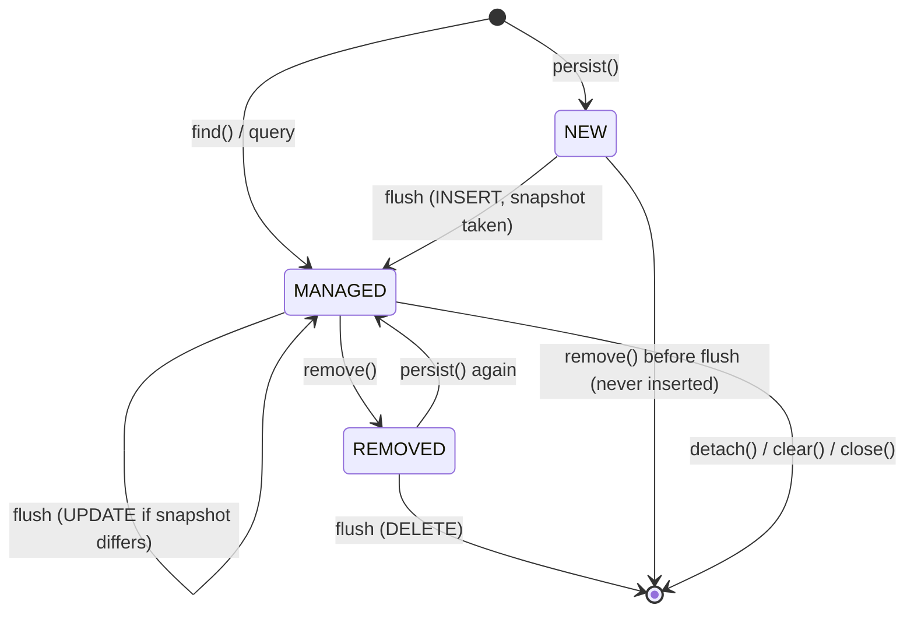

# Sessions and dirty checking

A `Session` is a unit of work: an identity map (first-level cache) plus change tracking, bound to
one JDBC connection that it takes from the `DataSource` on first use and returns on `close()`.

## Dirty checking by snapshot

When an entity becomes managed the session stores a **snapshot**: one database-side value per
column (after the `TypeConverter`). At flush it extracts the same array from the live object and
compares column by column. Differences become `UPDATE ... SET <only those columns>`.

Consequences:

* No base class, no bytecode enhancement, no setter interception. A plain field write is enough.
* In-place mutation is seen: a `byte[]` is copied into the snapshot, and `@Json` values are
  compared by their serialised text.
* Setting a value and setting it back produces no UPDATE.
* `BigDecimal` compares by numeric value (`5.5` equals `5.50`).
* Cost is proportional to the number of managed entities at each flush. Keep sessions short.

## Flush

A flush happens at commit, before a query inside a transaction (so a query sees the session's own
writes), and when you call `session.flush()`. Order: INSERTs, UPDATEs, DELETEs.

* **Inserts** are ordered by a topological sort over foreign keys (parents first). Among rows
  that are ready, the entity type's rank in the model's foreign-key order and then the order of
  `persist` decide, which keeps rows of one table together so they go out as one JDBC batch.
  An identity-keyed row that needs the generated id of a row in the same batch starts a new batch.
* **Updates** with the same set of changed columns are batched; the SQL text is cached per shape.
* **Deletes** use the reverse dependency order.
* A reference to an object that was never persisted fails with `TransientReferenceException`
  at flush instead of silently writing NULL.

## Optimistic locking

With `@Version`, every UPDATE and DELETE adds `and version = ?` and an UPDATE also sets
`version = version + 1`. A statement that matches no row raises `OptimisticLockException`
(entity class, id and expected version are available). `merge` of a detached copy older than the
row raises it too. Handle it by rolling back and retrying on fresh state.

## Pessimistic locking

`session.find(User.class, id, LockMode.FOR_UPDATE)` flushes, then reads with `FOR UPDATE` and
refreshes the managed instance. `FOR_UPDATE_NOWAIT` fails at once with `PessimisticLockException`.
`Query.lock(mode)` does the same for a query.

## Transactions

`session.inTransaction(tx -> ...)` commits when the callback returns and rolls back when it
throws. Rolling back clears the persistence context, because its entities no longer match the
database. A nested `inTransaction` joins the outer one; if it throws, the outer transaction is
marked rollback-only and its commit fails with `TransactionException`. For a part that may fail
without ending the transaction use `tx.inSavepoint(() -> ...)`: it rolls back to a savepoint and
rethrows, and the caller may catch. After a rollback to a savepoint the session is cleared, since
its in-memory state cannot be rewound.

## Lazy loading

A lazy `@ManyToOne` holds a generated subclass of the target. Reading its id does not load it; any
other method call loads the row once and forwards to the real, managed instance (so dirty checking
watches one object). Lazy collections load on first access. After `close()`, or for a detached
owner, touching an uninitialised proxy or collection throws `LazyInitializationException`.
Use `fetch(...)` on a query to load associations up front; see [querying](querying.md).
